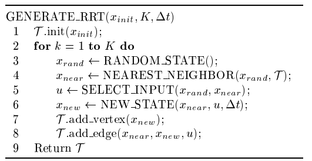
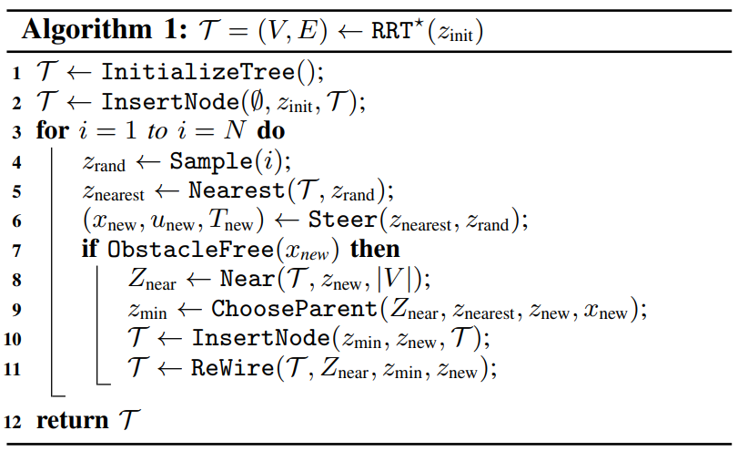
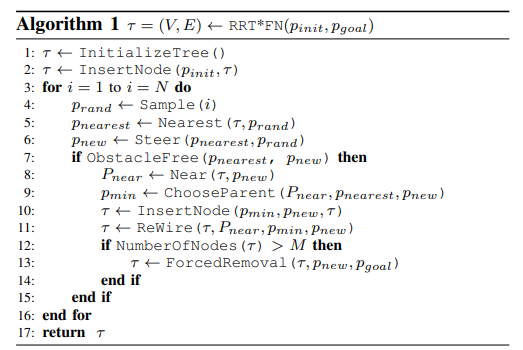
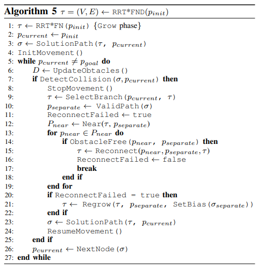
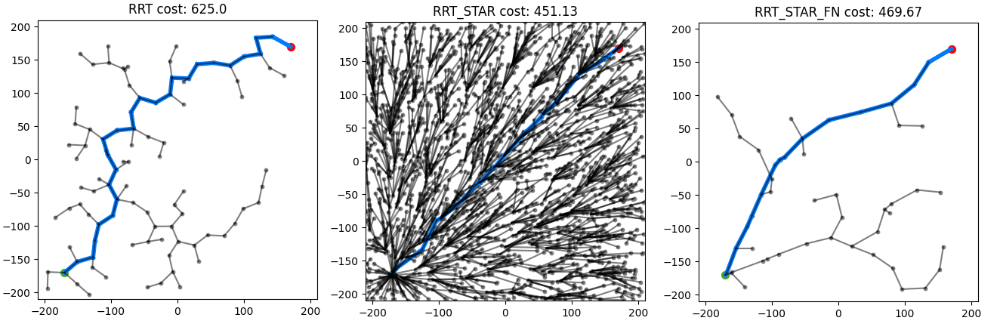
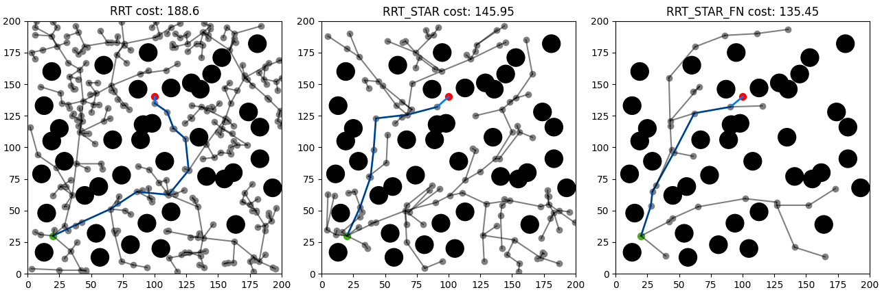

# RRT-STAR-FND-Algorithm

Simulation of RRT, RRT*, RRT*-FN and RRT*-FND algorithms.

<h3>RRT</h3> is a standard path planning algorithm using random trees to find obstacle-free paths developed by LaValle ([LaValle RRT](http://msl.cs.uiuc.edu/~lavalle/papers/Lav98c.pdf)).

<h3>RRT*</h3> is a modification to RRT that in limit seeks optimality.

<h3>RRT*-FN</h3> limits memory usage by limiting the number of nodes in the tree.

<h3>RRT*-FND</h3> is a dynamic algorithm capable of replanning the path when obstacle is detected.

## Usage examples

